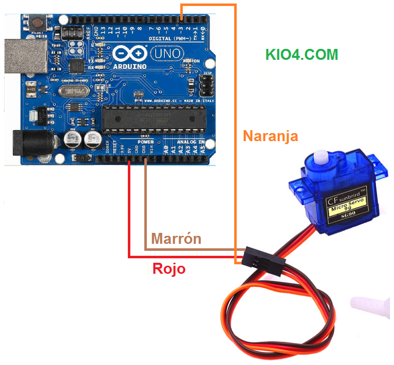
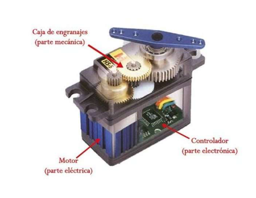
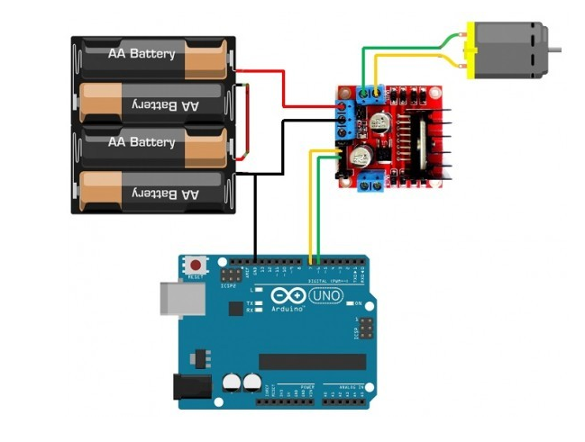
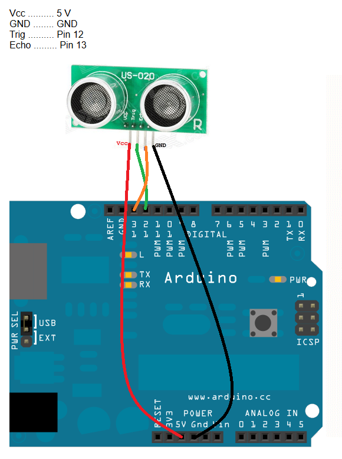

# Componentes del robot

| Componentes |  Modelo |
| :--- | :---: |
| Servomotor| MG996R |
| Escudo | L298N |
| Sensores de ultrasonidos|  HC-SR04  |
| Placa | Arduino Uno |
| Motor| Modelo TT con reducción de velocidad 1:40. |
| Baterías | 2 x 18650 of 9900 mAh cada una |
| Cámara |PixyCam 2 |
| Giroscopio |BNO055 |

## Servomotor
Un servo (o servomotor) es un motor eléctrico especial que permite controlar con total exactitud la posición de su eje, su velocidad y su fuerza. Hay servos que se pueden mover 360º y otros que solo permiten 180º.Viene con tres cables de conexión y varios elementos de giro.
- El cable rojo es el positivo (5 V), el marrón el negativo y el naranja el de control (3,3 V).

Un servomotor por dentro está formado principalmente por un motor eléctrico, una caja de reducción de engranajes, un potenciómetro o sensor de posición y una placa de circuito impreso de control. Los engranajes reducen la alta velocidad del motor y multiplican la fuerza de giro.

Basándonos en experiencias anteriores, directamente hemos optado por el servomotor MG996R ya que funciona controlando ángulos de giro en lugar de controlar la velocidad del propio servomotor. Esto facilita bastante todo ya que ahora podemos mover las ruedas delanteras con más precisión y requiriendo mucho menos esfuerzo. El modelo que elegimos fue el MG996R, como ya he dicho, ya que es conocido por ser más potente y por tener un buen rango de movimiento para este tipo de proyectos.

|  | **Specifications** |
|------------------------------|------------------------------|
| **Model:** MG996R | **Operating Voltage:** 4.8V – 7.2V |
| **Logic Voltage:** 3.3V / 5V compatible | **PWM Frequency:** 50 Hz (20 ms period) |
| **Stall Torque:** 9.4 kg·cm @ 4.8V / 11 kg·cm @ 6.0V | **Features:** Digital servo, metal gears, dual ball bearings, approximately 180° rotation|
| **Control Interface:** PWM (3-wire: Signal, VCC, GND) | **Operating speed:** 0.17 s/60° @ 4.8V, 0.14 s/60° @ 6.0V |
| 🔗 **[Buy Here](https://es.aliexpress.com/item/1005012099566939.html?src=google&src=google&albch=shopping&acnt=439-079-4345&isdl=y&slnk=&plac=&mtctp=&albbt=Google_7_shopping&aff_platform=google&aff_short_key=UneMJZVf&gclsrc=aw.ds&albagn=888888&ds_e_adid=&ds_e_matchtype=&ds_e_device=c&ds_e_network=x&ds_e_product_group_id=&ds_e_product_id=es1005012099566939&ds_e_product_merchant_id=5762056048&ds_e_product_country=ES&ds_e_product_language=es&ds_e_product_channel=online&ds_e_product_store_id=&ds_url_v=2&albcp=21840696692&albag=&isSmbAutoCall=false&needSmbHouyi=false&gad_source=1&gad_campaignid=21844625911&gbraid=0AAAAACbpfvY6Tr7heMhr1Ue2c3Xx6zC0y&gclid=Cj0KCQjwteTUBhD4ARIsAEYjs3qgW-0pwn4_eohH-4rpaZBpYEAsZsWip29HAc8yWjpGnKSZb1OpuhcaAjW6EALw_wcB)** | **Function:** Controls the steering system |

## Escudo
Un escudo es una placa electrónica con un doble puente H que permite controlar la velocidad y la dirección de motores de corriente continua (DC) usando tarjetas como Ardu
El escudo que hemos utilizado ha sido el modelo L298N, y lo usamos principalmente para hacer las conexiones de los motores. Este escudo nos ha permitido controlar el movimiento de los motores de una forma más sencilla, ya que se encarga de enviar la energía necesaria para que funcionen correctamente. Además ya eramos conscientes de la incompatibilidad del escudo DRV8835 de Pololu con nuestros motores. Por lo tanto, seleccionamos directamente el modelo L298N. Lo conectamos de la siguiente manera: 

|  | **Specifications** |
|------------------------------|------------------------------|
| **Model:** L298N Dual H-Bridge Motor Driver Module | **Operating Voltage:** 5V – 35V (motor supply) |
| **Logic Voltage:** 5V TTL compatible | **PWM Frequency:** Up to 25–30 kHz |
| **Max Continuous Current:** 2A per channel  |**Max Peak Current:** 3A per channel (short duration)|
| **Control Interface:** PWM + Direction pins (IN1–IN4, ENA, ENB) |**Built-in Features:** Dual H-Bridge, 5V regulator (78M05), thermal protection, flyback diodes |
| 🔗 **[Buy Here](https://es.aliexpress.com/item/1005007921497376.html?src=google&src=google&albch=shopping&acnt=439-079-4345&isdl=y&slnk=&plac=&mtctp=&albbt=Google_7_shopping&aff_platform=google&aff_short_key=UneMJZVf&gclsrc=aw.ds&albagn=888888&ds_e_adid=&ds_e_matchtype=&ds_e_device=c&ds_e_network=x&ds_e_product_group_id=&ds_e_product_id=es1005007921497376&ds_e_product_merchant_id=5762056048&ds_e_product_country=ES&ds_e_product_language=es&ds_e_product_channel=online&ds_e_product_store_id=&ds_url_v=2&albcp=21840696692&albag=&isSmbAutoCall=false&needSmbHouyi=false&gad_source=1&gad_campaignid=21844625911&gbraid=0AAAAACbpfvY6Tr7heMhr1Ue2c3Xx6zC0y&gclid=Cj0KCQjwteTUBhD4ARIsAEYjs3oVV1d5k8KFNlUW8mpFq3IWZp6DEnsA46ibw2MTa2oFglrS0UgNisQaAn_dEALw_wcB)** | **Function:** Controls the speed and direction of DC motors and stepper motors using PWM and H-Bridge switching |

## Sensores de ultrasonidos 
Un sensor ultrasónico es un dispositivo electrónico que mide la distancia y detecta objetos mediante el uso de ondas sonoras de alta frecuencia que no escucha el oído humano. Funciona de tal modo que el sensor envía un pulso de sonido ultrasónico a través del aire y la onda choca contra un objeto cercano y regresa en forma de eco. El aparato mide el tiempo exacto que tarda el eco en ir y volver para calcular la distancia con la fórmula de velocidad del sonido. Y así, consigue medir distancias. Se conecta de tal manera:

Para la correcta programación de nuestro robot necesitábamos disponer de tres sensores ultrasónicos de distancia para conseguir que el robot no impactara ni tocara ninguna pared. Para la implementación de estos en el chasis utilizamos una estructura diseñada previamente en la interfaz de TinkerCad y la imprimimos en 3D. Esto nos permitió sujetar bien los tres sensores de ultrasonidos. De tal modo que nos aseguramos que los sensores se mantienen en su sitio sin caerse mientras hacíamos pruebas.

|  | **Specifications** |
|------------------------------|------------------------------|
| **Model:** HC-SRO4 | **Operating Voltage:** 5V DC |
| **Logic Voltage:** 5V TTL compatible | **PWM Frequency:** 40 kHz |
| **Measuring Range:** 2 cm – 400 cm |**Measurement Accuracy:** ±3 mm|
| **Control Interface:** Trigger (TRIG) + Echo (ECHO) digital pins |**Built-in Features:** Non-contact distance measurement, low power consumption, automatic echo detection |
| 🔗 **[Buy Here](https://es.aliexpress.com/item/1005008222329963.html?src=google&snpsid=1&src=google&albch=shopping&acnt=439-079-4345&isdl=y&slnk=&plac=&mtctp=&albbt=Google_7_shopping&aff_platform=google&aff_short_key=UneMJZVf&gclsrc=aw.ds&albagn=888888&ds_e_adid=&ds_e_matchtype=&ds_e_device=c&ds_e_network=x&ds_e_product_group_id=&ds_e_product_id=es1005008222329963&ds_e_product_merchant_id=5551326180&ds_e_product_country=ES&ds_e_product_language=es&ds_e_product_channel=online&ds_e_product_store_id=&ds_url_v=2&albcp=21840696692&albag=&isSmbAutoCall=false&needSmbHouyi=false&gad_source=1&gad_campaignid=21844625911&gbraid=0AAAAACbpfvY6Tr7heMhr1Ue2c3Xx6zC0y&gclid=Cj0KCQjwteTUBhD4ARIsAEYjs3q9SFLaalZTnOR2RG_ic11psDn8Sgzc2-KZxXnwqmY6ke_l_SUegJ4aAtzxEALw_wcB)** | **Function:** Measures the distance to objects by transmitting and receiving ultrasonic waves|

## Placa 
La placa que hemos utilizado para nuestro robot ha sido la Arduino Uno R3. Decidimos usar esta placa porque ya habíamos trabajado con Arduino en otras ocasiones y nos parecía más fácil de entender. Además, es muy útil para conectar sensores, cables y otros componentes debido a su multitud de pines, y luego programarla para que funcione como queremos. Gracias a esto, pudimos hacer la programación del robot de forma más sencilla y aprender mejor cómo funciona la programación y la electrónica.

Llamamos Arduino a una placa, normalmente de color azul, en donde se encuentra un microcontrolador que se puede programar facilmente con lenguaje C básico y conectándolo a nuestro ordenador. Con él podemos hacer un juego de luces, mover servomotores, comunicarnos con el Android por Bluetooth, ver información de un sensor de temperatura en una pantalla LCD,...
Se conecta mediante un cable USB al ordenador. 

|  | **Specifications** |
|------------------------------|------------------------------|
| **Model:** Arduino Uno R3 | **Operating Voltage:** 5V  |
| **Input Voltage:** 7–12V recommended (6–20V limit) | **Clock Frequency:** 16 MHz |
|**Microcontroller:** ATmega328P|**Memory:** 32 KB Flash, 2 KB SRAM, 1 KB EEPROM|
| **Digital I/O Pins:** 14 (6 PWM outputs) |**Analog Inputs:** 6 (10-bit ADC) |
| **Communication Interfaces:** UART, I²C, SPI, USB|**Features:** USB Type-B, ICSP header, reset button, onboard voltage regulator, replaceable ATmega328P |
| 🔗 **[Buy Here](https://www.amazon.es/Arduino-UNO-A000066-microcontrolador-ATmega328/dp/B008GRTSV6/ref=sr_1_3_sspa?adgrpid=69804669291&dib=eyJ2IjoiMSJ9.Vj7GES04FN79u2IKKbZGbmtaiTZxHpF06kPx-yBqQP3OEEiwDU6h4ZE7XuWOQWmfuJe2tgS4Gf8b9r_yJNaLDAHphZ5I6v3RAr6olylU6NULE_8TiMOkuD71w1lECLE7q-ZU2XoOO2pu6b0JcaF6cbXokf1VjjENlydWZdyHgwcf6hTqO3_uIaTuNKVp19kZMbxjcMFEfG9kFxUNK7Sx2y40DNBq5jBJHy0CO3DfwcVu9gHqiTd5k6nCHpb4d5JavMbgxnv_VDVp_RR9_09SBhExXyYmfWcq1swjQIl7gVM.FmIZf9fJWDuwM1RN3wVmcDkAdhYunt2sanVpc3WmUgE&dib_tag=se&hvadid=320777155811&hvdev=c&hvexpln=0&hvlocphy=9199249&hvnetw=g&hvocijid=11397190425051405773--&hvqmt=e&hvrand=11397190425051405773&hvtargid=kwd-297743301498&hydadcr=23168_1793047&keywords=placa%2Barduino%2Buno&mcid=3099ea86dcbb3233b18e8a4f553fb756&qid=1788450832&sr=8-3-spons&aref=WYtrmVaIaw&sp_csd=d2lkZ2V0TmFtZT1zcF9hdGY&th=1)** | **Function:** Programmable microcontroller board for controlling sensors, actuators, and embedded electronic systems. |

## Motor
Para conseguir que el robot se pueda mover, hemos utilizado solo un motor que van conectados a las ruedas traseras. No pusimos motores en las ruedas delanteras porque no eran necesarios. En vez de eso, decidimos controlar la dirección del robot usando dos ruedas delanteras que están conectadas a un servomotor. De tal manera que el servomotor permite que el robot se mueva hacia la izquierda o hacia la derecha, encargándose de su dirección.

|  | **Specifications** |
|------------------------------|------------------------------|
| **Model:** TT DC Gear Motor| **Operating Voltage:** 3V – 6V DC  |
|**Rated Voltage:** 6V DC | **No-Load Speed:** ≈200 RPM @ 6V (varies by gear ratio) |
|**Stall Current:** ≈1.2 A|**No-Load Current:** ≈150–250 mA|
|**Output Shaft:** Double D Shaft |**Gearbox Type:** Plastic reduction gearbox|
|**Motor Type:** Brushed DC Motor|**Features:** High torque, low cost, lightweight, suitable for robot cars |
| 🔗 **[Buy Here](https://www.amazon.es/3-6V-Motor-Arduino-Smart-Robot/dp/B08MT8KL2B)** | **Function:** Provides rotational motion to drive robot wheels and other small mechanical systems. |

## Baterías
Las baterías 18650 que son de ion de litio son ampliamente usadas en robótica y electrónica, y es por esto que son las que hemos usado. Su voltaje máximo son 4.2 V cargadas completamente. Y la capacidad de la batería en este caso, 9900 mAh (aunque muchas veces las baterías baratas "de 9900 mAh" no entregan realmente esa capacidad; suelen estar sobreestimadas). Con las dos baterías apiladas en serie tendríamos para 4 cargas enteras de un móvil, por ejemplo. Además, un beneficio de estas baterías es que son recargables. 

|  | **Specifications** |
|------------------------------|------------------------------|
| **Model:** 18650 Li-ion Rechargeable Battery| **Nominal Voltage:** 3.7V |
|**Maximum Voltage:** 4.2V (fully charged) | **Minimum Discharge Voltage:** 2.5–3.0V |
|**Rated Capacity:** 9900 mAh*|**Rechargeable:** Yes|
|**Configuration:** Can be connected in series or parallel |**Battery Type:** Lithium-ion (Li-ion)|
|**Note:** Many low-cost batteries advertised as 9900 mAh do not actually achieve this capacity. Most genuine 18650 Li-ion cells from reputable manufacturers have capacities in the 2000–3500 mAh range|**Features:** High energy density, low self-discharge, rechargeable, lightweight |
| 🔗 **[Buy Here](https://es.aliexpress.com/item/1005007975621227.html?src=google&src=google&albch=shopping&acnt=439-079-4345&isdl=y&slnk=&plac=&mtctp=&albbt=Google_7_shopping&aff_platform=google&aff_short_key=UneMJZVf&gclsrc=aw.ds&albagn=888888&ds_e_adid=&ds_e_matchtype=&ds_e_device=c&ds_e_network=x&ds_e_product_group_id=&ds_e_product_id=es1005007975621227&ds_e_product_merchant_id=5445746250&ds_e_product_country=ES&ds_e_product_language=es&ds_e_product_channel=online&ds_e_product_store_id=&ds_url_v=2&albcp=21840696692&albag=&isSmbAutoCall=false&needSmbHouyi=false&gad_source=1&gad_campaignid=21844625911&gbraid=0AAAAACbpfvY6Tr7heMhr1Ue2c3Xx6zC0y&gclid=Cj0KCQjwteTUBhD4ARIsAEYjs3ojJ9yLZBzr1O5j3zBbPf4AU3kRp23NCWbZHPOVBxqpzETvLth4OAIaAuNUEALw_wcB)** | **Function:** Supplies portable power for robotics, electronic projects, and battery-powered systems. |

## Cámara
La Pixy2 es una cámara capaz de detectar, rastrear y seguir objetos en tiempo real sin necesidad de un ordenador potente. Puede aprender a detectar hasta 7 colores diferentes simultáneamente y es compatible con Arduino, Raspberry Pi y otros microcontroladores. Se conecta por SPI, I2C, UART, USB o pines digitales/analógicos. Primero hay que hacer una configuración inicial en su propio software (PixyMon), y entrenar la cámara para detectar los colores de los distintos objetos. Una vez programado esto en su propia interfaz, pasamos a incluirla en el programa de Arduino para establecer las órdenes que tiene que seguir posteriormente. 

Era totalmente necesario su incoporación para el Obstacle Challenge. Esta nos permitiría diferenciar los colores de los distintos semáforos y poder decidir el ángulo y dirección de giro.

|  | **Specifications** |
|------------------------------|------------------------------|
| **Model:** Pixy2 CMUcam5| **Nominal Voltage:** 5V DC (regulated) or 6–10V DC (unregulated, via Vin pin) |
|**Logic Voltage:** 3.3V (digital/I2C lines) |  **Current Consumption:** ~140 mA at 5V|
|**Image Sensor:** Aptina MT9M114, 1296×976 resolution with integrated image flow processor |**Field of View:** 60° horizontal, 40° vertical|
|**Frame Rate:** 60 fps (16.7 ms per frame) | **Processor:** NXP LPC4330, dual-core, 204 MHz|
|**Control Interface:** UART serial, SPI, I2C, USB, digital, analog|**Built-in Features:** Color-based object learning/detection, line and intersection tracking, barcode-style "road sign" detection, onboard memory for up to 7 saved objects, integrated LED light source (~20 lumens)|
| 🔗 **[Buy Here](https://eu.robotshop.com/es/products/sensor-de-imagen-de-vision-robotica-pixy-21-de-charmed-labs?gad_source=1&gad_campaignid=20151977646&gbraid=0AAAAAD_f_xyTTc3D6DgA-EzSpU38W9Ajj&gclid=Cj0KCQjwteTUBhD4ARIsAEYjs3pSliz38hXgobSBDR2CWHVE9Ir7rqIC_WgeYnrKgPRKOID7nr_NkakaAq7yEALw_wcB)** |**Function:** Smart vision sensor that processes images onboard to recognize and track objects by color, lines, and signs — freeing the main microcontroller (Arduino/Raspberry Pi) from that processing load. |

