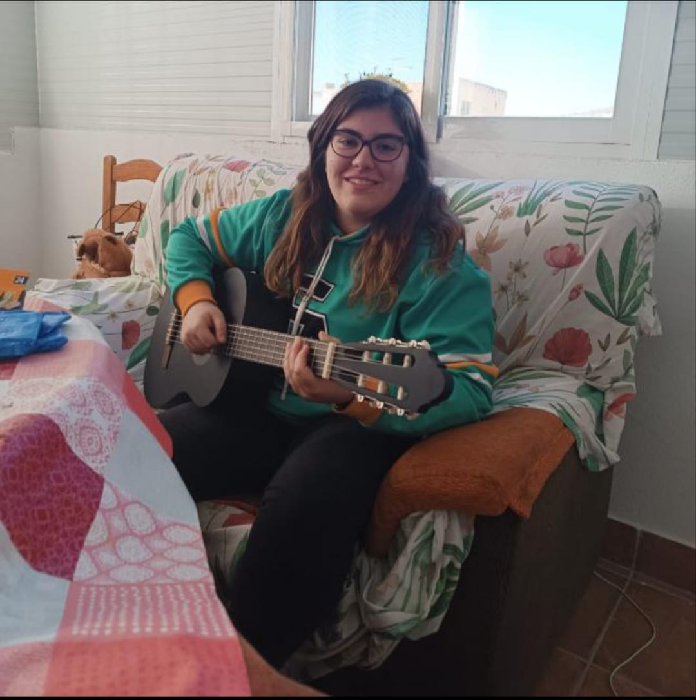

# Presentacción del equipo
¡Hola! Somos Azzaiteras WALL-E, un equipo compuesto por Noa Torres Serra, Eva Espinosa Ortiz y Lidia Requena Torres. Somos dos actuales alumnas y una exalumna del IES Az-Zait, un pequeño instituto de Jaén con un gran equipo de robótica.

## Sobre Eva
¡Hola! Soy Eva. Tengo 16 años y soy una antigua estudiante del instituto Az-Zait. Estoy en 1º de Bachillerato de humanidades y ciencias sociales. Aunque siempre he sido de letras, desde que entré al Az-Zait he estado en el equipo de robótica, y me apasiona. He participado dos veces en dos años diferentes en la WRO de Jaén, he estado en la WRO Nacional en 2023 en la Seu d´Urgel. También he participado en la WRO de Madrid. Y en la última competición en la que participé fue en el Open de Brescia, en septiembre de 2024. Soy una chica trabajadora, graciosa y a veces demasiado perfeccionista. Por eso mismo, me gusta desconectar y disfrutar con mis amigos los fin de semana. 

## Sobre Lidia
Mi nombre es Lidia Requena Torres, tengo 17 años y actualmente estoy estudiando en otro instituto un grado formativo sobre Atención a Personas en Situación de Dependencia. Llevo los cuatro años de la ESO participando en robótica, ya que me parece muy interesante, entretenido y lo más importante, ¡divertido! Me dieron la oportunidad de seguir participando por las tardes y no me lo pensé. Aprendo mucho con nuestro maravilloso profesor y me lo paso genial con mi equipo. Mis hobbies son jugar al fútbol, estar con mis amigos y familia. Me gustan mucho estar con los niños pequeños.

